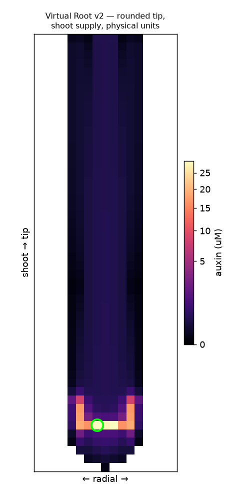

# Virtual Root — an open, rebuildable "SimuPlant"

Goal: reverse-engineer a modern, open, web-deployable replacement for **SimuPlant /
"The Virtual Root"** (University of Nottingham CPIB) — a cell-based simulator of polar
auxin transport in the Arabidopsis root tip — to serve as the live tool behind AIRI
Stage VII (the original SimuPlant website is offline).

## What SimuPlant was
- Open-source software built on the **OpenAlea** Python framework.
- A no-code GUI over a **cell-grid model of auxin transport** (PIN efflux + AUX1 influx)
  on a real root-tip geometry; outputs the predicted auxin distribution as images.
- Documented in: *The Virtual Root: Mathematical Modeling of Auxin Transport in the
  Arabidopsis Root Tip Using SimuPlant* (2021), PubMed 34822153 — the de-facto spec.
- Underlying science: **Grieneisen et al. 2007** reflux / "reverse-fountain" model.

## The model (`auxin_reflux.py`)
A from-scratch NumPy steady-state solver. Each cell exchanges auxin with its 4 neighbours via:
- passive diffusion (permeability `D`),
- PIN-mediated active efflux (`p`) in a tissue-specific polar direction,
- AUX1-mediated active influx (`a`), concentrated at the tip,
plus a shoot-end source (`S`), decay (`k`), and open-boundary efflux.

## Status
- **`auxin_reflux.py` (v0)** — single-compartment cell-to-cell model. Transports auxin but
  could NOT seat the QC maximum (auxin piled at boundaries). Kept as a learning artifact.
- **`auxin_v1.py` (v1)** — ✅ two-compartment (cell + apoplast wall) model built to SPEC.md.
  First to reproduce the **canonical auxin maximum at the QC** on a layered rectangle.
- **`auxin_v2.py` (v2)** — ✅ **fidelity polish** and the basis for the live web app:
  **rounded root-tip template**, a **shoot-derived auxin supply** so auxin fills the whole
  root in a **smooth shootward gradient**, and **physical units** (Grieneisen permeabilities
  in µm/s, 10 µm cells, time in seconds, auxin in µM). QC remains the maximum.



### Interactive web app (`docs/`, live via GitHub Pages)
A dependency-free browser app running the v2 model, with:
- **Anatomy labels** (stele, cortex, epidermis, columella, QC) — toggleable.
- **Auxin-flux arrows** that trace the **reflux loop** (down the stele, up the outer layers).
- **Presets:** Wild type · Gravistimulate · **PIN2 mutant** · **aux1 mutant** · No decay.
- **Animated gravitropism** — auxin redistributes to the lower side, with a live bending indicator.
- Live sliders (PIN, AUX1, QC production, decay) and **Save PNG** export.

### What makes it work
1. Separate cell + wall compartments with per-membrane-side influx/efflux permeabilities.
2. The Band 2014 PIN map (rootward stele, shootward cap/epidermis, lateral-inward tip,
   omnidirectional columella) — but the **QC kept as a trap**, not omnidirectional.
3. AUX1 influx in cap/columella/epidermis to hold auxin at the tip.
4. A **shoot supply** + small QC/columella source: the tip is the maximum, atop a gradient.
5. Display uses a **gamma colour scale** (γ≈0.45), as auxin reporters (DR5/DII) span orders
   of magnitude — this reveals the shootward gradient that a linear scale would hide.

### Still open (optional, not publication-grade)
- A truly *digitised* root cell template (v2 is an idealised rounded section).
- Quantitative validation of the µM levels and timescales against DII-VENUS data.
- Balance of the lateral cap signal vs the central peak.

## Next steps to full fidelity
1. Extract the exact PIN/AUX1 polarity maps and parameter values from Grieneisen 2007
   (supplement) and/or the 2021 Virtual Root protocol paper.
2. Replace the rectangular grid with a **digitized root cell template** (the real
   tissue geometry SimuPlant used) — likely the single biggest fix.
3. Validate against the published QC-maximum result.
4. Build the interactive UI (sliders for PIN/AUX1/D/decay; PNG + data export).
5. Ship it **durably**: pure-JS on GitHub Pages (cannot go offline) or Streamlit/HF
   Spaces; embed into AIRI Stage VII.

## Run
```bash
pip install numpy matplotlib
python auxin_reflux.py   # writes auxin_reflux.png
```
