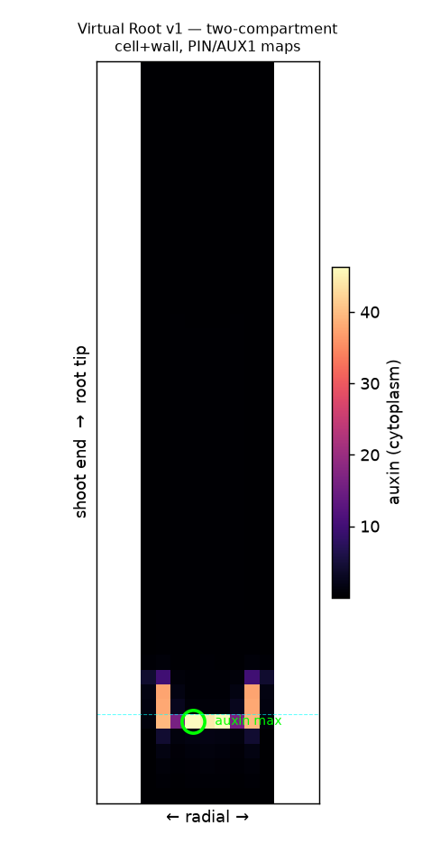

# Virtual Root — an open, rebuildable "SimuPlant"

Goal: reverse-engineer a modern, open, web-deployable replacement for **SimuPlant /
"The Virtual Root"** (University of Nottingham CPIB) — a cell-based simulator of polar
auxin transport in the Arabidopsis root tip — to serve as the live tool behind AIRI
Stage VII (the original SimuPlant website is offline).

## What SimuPlant was
- Open-source software built on the **OpenAlea** Python framework.
- A no-code GUI over a **cell-grid model of auxin transport** (PIN efflux + AUX1 influx)
  on a real root-tip geometry; outputs the predicted auxin distribution as images.
- Documented in: *The Virtual Root: Mathematical Modeling of Auxin Transport in the
  Arabidopsis Root Tip Using SimuPlant* (2021), PubMed 34822153 — the de-facto spec.
- Underlying science: **Grieneisen et al. 2007** reflux / "reverse-fountain" model.

## The model (`auxin_reflux.py`)
A from-scratch NumPy steady-state solver. Each cell exchanges auxin with its 4 neighbours via:
- passive diffusion (permeability `D`),
- PIN-mediated active efflux (`p`) in a tissue-specific polar direction,
- AUX1-mediated active influx (`a`), concentrated at the tip,
plus a shoot-end source (`S`), decay (`k`), and open-boundary efflux.

## Status
- **`auxin_reflux.py` (v0)** — single-compartment cell-to-cell model. Transports auxin but
  could NOT seat the QC maximum (auxin piled at boundaries). Kept as a learning artifact.
- **`auxin_v1.py` (v1)** — ✅ **two-compartment (cell + apoplast wall) model built to SPEC.md.**
  Reproduces the **canonical auxin maximum at the QC** (central, at the tip), with high
  auxin in the lateral root cap and a tip-concentrated gradient. This is the validation
  target from Grieneisen 2007 / Band 2014.



### What made v1 work (vs v0)
1. Separate cell + wall compartments with per-membrane-side influx/efflux permeabilities.
2. The Band 2014 PIN map (rootward stele, shootward cap/epidermis, lateral-inward tip,
   omnidirectional columella) — but the **QC kept as a low-efflux trap**, not omnidirectional.
3. AUX1 influx (×4) in cap/columella/epidermis to trap auxin at the tip.
4. **Elevated auxin production at the QC + columella** (the local source).

### Next refinements (v1 is a valid proof, not yet publication-grade)
- Extend the shootward gradient further up the root (tune diffusion/transport balance).
- Balance the two lateral cap streaks vs the central peak.
- Replace the layered rectangle with a **digitised / rounded root cell template**.
- Convert µm·s⁻¹ permeabilities to real time units and validate quantitatively.

## Next steps to full fidelity
1. Extract the exact PIN/AUX1 polarity maps and parameter values from Grieneisen 2007
   (supplement) and/or the 2021 Virtual Root protocol paper.
2. Replace the rectangular grid with a **digitized root cell template** (the real
   tissue geometry SimuPlant used) — likely the single biggest fix.
3. Validate against the published QC-maximum result.
4. Build the interactive UI (sliders for PIN/AUX1/D/decay; PNG + data export).
5. Ship it **durably**: pure-JS on GitHub Pages (cannot go offline) or Streamlit/HF
   Spaces; embed into AIRI Stage VII.

## Run
```bash
pip install numpy matplotlib
python auxin_reflux.py   # writes auxin_reflux.png
```
